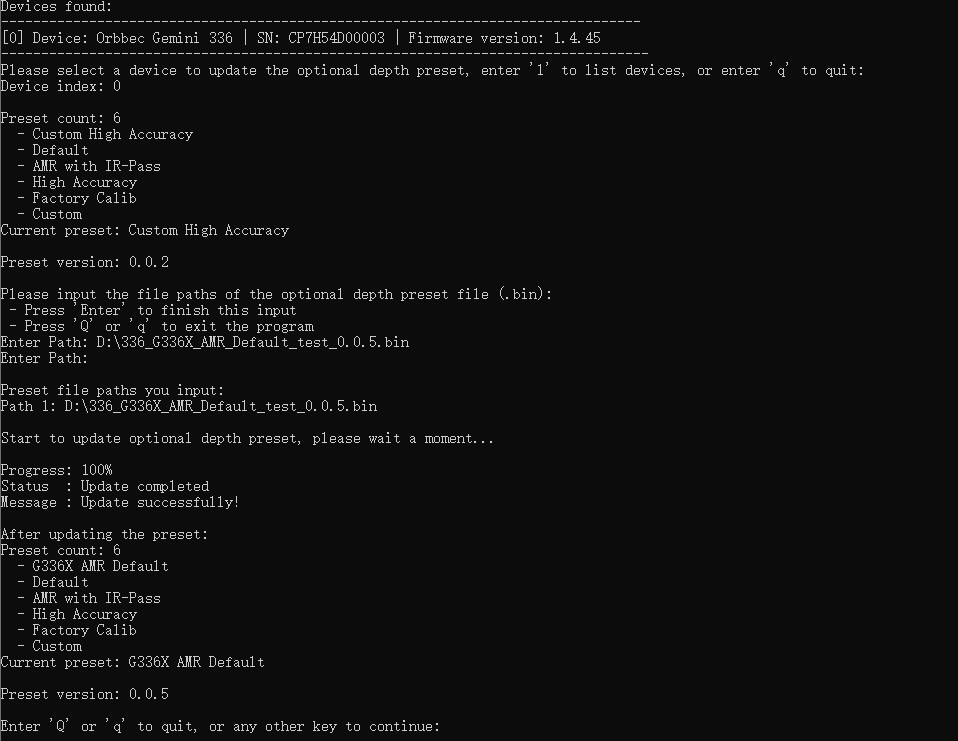

# C++ Sample：2.device.optional_depth_presets_update

## Overview

This sample demonstrates how to use the SDK to update the optional depth presets of a connected device. It includes functions to list connected devices, select a device, and update its depth presets.

> Note: This sample is only applicable to devices that support presets, such as G330 serials of devices

### Knowledge

Context is the environment context, the first object created during initialization, which can be used to perform some settings, including but not limited to device status change callbacks, log level settings, etc. Context can access multiple Devices.

Device is the device object, which can be used to obtain the device information, such as the model, serial number, and various sensors.One actual hardware device corresponds to one Device object.

## code overview

1. Initialize the SDK Context: This is necessary to access the connected devices.

    ```c++
        std::shared_ptr<ob::Context> context = std::make_shared<ob::Context>();
    ```
2. List Connected Devices.

    ```c++
        std::shared_ptr<ob::DeviceList> deviceList = context->queryDeviceList();
        for(uint32_t i = 0; i < deviceList->getCount(); ++i) {
            devices.push_back(deviceList->getDevice(i));
        }
    ```
3. Define a Callback Function for Firmware Update Progress.

    You can define a callback function to get the progress of the firmware update. The callback function will be called every time the device updates its progress.

    ```c++
        void presetUpdateCallback(OBFwUpdateState state, const char *message, uint8_t percent) {
            // show update state and message here
        }
    ```

4. Update the optional depth presets.

    After selecting a device, update its presets by calling the updateOptionalDepthPresets function with the specified callback.

    ```c++
        device->updateOptionalDepthPresets(filePaths, count, presetUpdateCallback);
    ```
    > Note: The api supports upgrading multiple presets at once. For G300 series devices, a maximum of 3 presets can be written at a time. The first preset written will be set as the default preset.

### Attention

1. After the optional depth presets update completes, you don't need to restart the device.

2. Don't plug out the device during the presets update process.


## Run Sample

Select the device for presets update and input the path of the presets file. The SDK will start updating the presets, and the progress will be displayed on the console.

### Result


