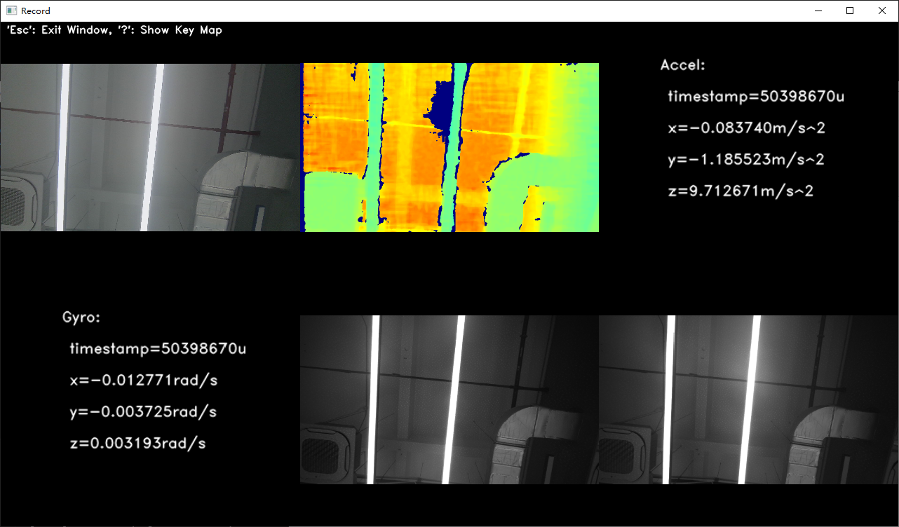

# C++ Sample：2.device.record

## Overview

This example demonstrates how to use the SDK to record video/sensor stream data from an Orbbec camera and output a ROS bag file (.bag).

### Knowledge

- **Pipeline**: Manages data streams with capabilities for multi-channel configuration, stream switching, frame aggregation, and synchronization.  
- **RecordDevice**: Handles data recording to a ROS bag file, supporting simultaneous capture from multiple sensors and streams.

## code overview

1. Create a Context object and get the specified device.

    ```cpp
        std::shared_ptr<ob::Context> context = std::make_shared<ob::Context>();

        auto device = deviceList->getDevice(0);
    ```

2. Instantiate a RecordDevice to capture all streams from the connected device into a ROS bag file:

    ```cpp
        auto recordDevice = std::make_shared<ob::RecordDevice>(device, filePath);
    ```

3. Configure and start the pipeline with a frame callback for real-time preview:

    ```cpp
        pipe->start(config, [&](std::shared_ptr<ob::FrameSet> frameSet) {
            std::lock_guard<std::mutex> lock(frameMutex);
            renderFrameSet = frameSet;
        });
    ```
4. Destroy the RecordDevice to flush and save the ROS bag file:

    ```cpp
        recordDevice = nullptr;
    ```

## Run Sample

Press the 'Esc' key in the window to exit the program.

### Result



