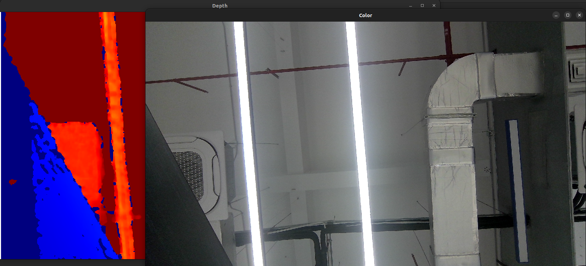

# C++ Sample: 5.wrapper.open3d

## Overview

This example shows how to capture synchronized color and depth frames from an Orbbec camera using the Orbbec SDK and render them in real time with Open3D's visualizer.

### About Open3D
Open3D is an open-source library designed for 3D data processing. It provides:

 - Efficient data structures for 3D geometry (point clouds, meshes)
 - Tensor-based operations with GPU support
 - High-level visualization tools (e.g., VisualizerWithKeyCallback)

For detailed installation instructions and advanced usage, visit the [Open3D GitHub repository](https://github.com/isl-org/Open3D).

### Knowledge

 - Pipeline: Manages multi-channel stream configuration, frame aggregation, and synchronization.

 - Frameset: A collection of synchronized frames of different types (e.g., color, depth).

 - Config: A set of parameters that define the behavior of the pipeline.


## Code overview

1. Configure the output format of color and depth frames.

    ```cpp
    auto pipeline = std::make_shared<ob::Pipeline>();

    // Configure which streams to enable or disable for the Pipeline by creating a Config.
    std::shared_ptr<ob::Config> config = std::make_shared<ob::Config>();

    config->enableVideoStream(OB_STREAM_COLOR, OB_WIDTH_ANY, OB_HEIGHT_ANY, OB_FPS_ANY, OB_FORMAT_RGB);
    config->enableVideoStream(OB_STREAM_DEPTH, OB_WIDTH_ANY, OB_HEIGHT_ANY, OB_FPS_ANY, OB_FORMAT_Y16);
    config->setFrameAggregateOutputMode(OB_FRAME_AGGREGATE_OUTPUT_ALL_TYPE_FRAME_REQUIRE);
    pipeline->enableFrameSync();
    ```

    The `OB_FRAME_AGGREGATE_OUTPUT_ALL_TYPE_FRAME_REQUIRE` mode ensures all frame types are present in each frameset.


2. Retrieve frames.

    ```cpp
    auto frameset = pipeline->waitForFrames();
    if(!frameset) {
        continue;
    }

    // Get the color and depth frames from the frameset.
    auto colorFrame = frameset->getFrame(OB_FRAME_COLOR)->as<ob::ColorFrame>();
    auto depthFrame = frameset->getFrame(OB_FRAME_DEPTH)->as<ob::DepthFrame>();
    ```

3. Convert to Open3D format.

    ```cpp
    std::shared_ptr<t::geometry::RGBDImage> preRgbd = std::make_shared<t::geometry::RGBDImage>();

    preRgbd->color_ =
        core::Tensor(static_cast<const uint8_t *>(colorFrame->getData()), { colorFrame->getHeight(), colorFrame->getWidth(), 3 }, core::Dtype::UInt8);
    preRgbd->depth_ =
        core::Tensor(reinterpret_cast<const uint16_t *>(depthFrame->getData()), { depthFrame->getHeight(), depthFrame->getWidth() }, core::Dtype::UInt16);
   ```

4. Visualize.

    ```cpp
    if(!windowsInited) {
        if(!colorVis.CreateVisualizerWindow("Color", 1280, 720) || !colorVis.AddGeometry(colorImage)) {
            return 0;
        }

        if(!depthVis.CreateVisualizerWindow("Depth", 1280, 720) || !depthVis.AddGeometry(depthImage)) {
            return 0;
        }
        windowsInited = true;
    }
    else {
        colorVis.UpdateGeometry(colorImage);
        depthVis.UpdateGeometry(depthImage);
    }
    depthVis.PollEvents();
    depthVis.UpdateRender();

    colorVis.PollEvents();
    colorVis.UpdateRender();
    ```
5. Shutdown.
Press `ESC` in either window to exit and stop the pipeline.

## Build and run
```bash
mkdir build
cd build
cmake .. -DOB_BUILD_OPEN3D_EXAMPLES=ON -DOpen3D_DIR=<path to Open3D installation>
make -j4
./ob_open3d
```

### Result


